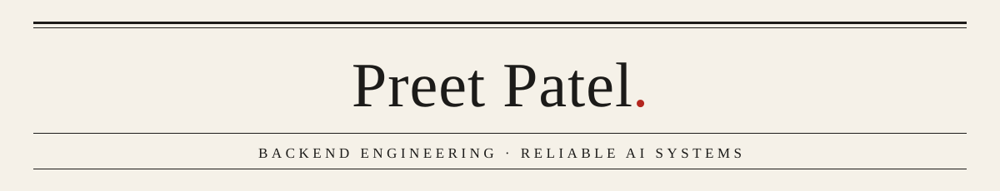

<picture>
  <source media="(prefers-color-scheme: dark)" srcset="./assets/masthead-dark.svg">
  
</picture>

I build the backend that makes AI features trustworthy: answers that cite their sources, 
test sets that catch regressions before they ship, and guardrails that keep cost and latency under control. 
<b>Open to full-time backend / AI engineering roles · Pune · Bangalore · Hyderabad · remote (India)</b>

  

### Building now

<table>
<tr>
<td width="50%" valign="top">

**Cited answers over SEBI and RBI circulars** 
Answers questions on Indian financial regulations with the exact circular and paragraph cited, tracks which rule is still in force, and refuses when it can't cite. 
Python · FastAPI · PostgreSQL/pgvector · hybrid search · evals in CI 
<i>In progress — goes public with measured results</i>

</td>
<td width="50%" valign="top">

**A gateway for every AI-model call** 
API-key and OAuth auth, rate limits, prompt cache, provider failover, and per-customer spend caps enforced from a Kafka stream. 
Java 21 · Spring Boot · Redis · Kafka · PostgreSQL 
<i>In progress — goes public with measured results</i>

</td>
</tr>
</table>

### Shipped

**[aws-vehicle-compliance-system](https://github.com/preetpatel1616/aws-vehicle-compliance-system)** — reads licence plates from vehicle photos with AWS Rekognition, checks insurance and registration in PostgreSQL, and emails the owner. Next.js, TypeScript, JWT auth, Docker, deploy pipeline to AWS.

### Stack

  Used in shipped work 
  

  Building with 
  

### Currently

Building the SEBI/RBI answer service first. The gateway comes next, and the answer service's model calls will run through it, so the two form one system.
